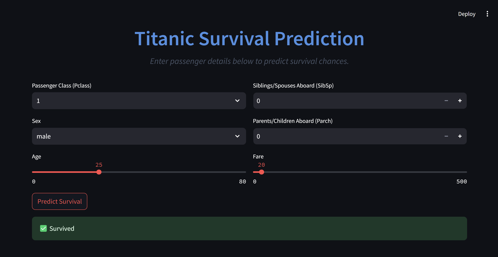

# 🚢 **Titanic Survival Predictor:- Containerized Streamlit App**

## 📌 **Overview**
The **Titanic Survival Prediction Model** is a machine learning application that predicts whether a passenger would have survived the Titanic disaster based on various input features. This project is built using **Python**, **scikit-learn**, **pandas**, and **Streamlit** for a user-friendly web interface. To ensure seamless deployment and portability, **Docker** is used to containerize the application.

---

## 📂 **Project Structure**

```bash
Titanic-Prediction-Model/
│── Dockerfile
│── requirements.txt
│── main.py
│── titanic_model.py
│── titanic_model.pkl
```

### **📜 Description of Files:**
- **`main.py`** → The Streamlit-based web application for user interaction.
- **`titanic_model.py`** → Script to train and save the Titanic survival prediction model.
- **`titanic_model.pkl`** → The serialized machine learning model used for making predictions.
- **`requirements.txt`** → A list of dependencies required to run the application.
- **`Dockerfile`** → Configuration file to containerize the application using Docker.

---

## 🤖 **Model Training (`titanic_model.py`)**
The model is trained using a **Random Forest Classifier** from `scikit-learn`, based on Titanic dataset features. After training, the model is saved as **`titanic_model.pkl`** using `joblib`, ensuring efficient storage and easy loading in the web application.

### **Steps in `titanic_model.py`**
1. **Load the Titanic dataset**.
2. **Preprocess missing values** and encode categorical data.
3. **Train the Random Forest Model**.
4. **Save the trained model** as `titanic_model.pkl`.

---

## 🎨 **Streamlit Application (`main.py`)**
The Streamlit app provides a clean and interactive interface for users to input passenger details and predict survival chances.

### **✨ Features:**
✔️ **User-friendly UI with enhanced CSS**
✔️ **Live prediction updates** using the trained `.pkl` file
✔️ **Interactive sliders and dropdowns** for input selection

---

## 🐳 **Docker Setup**
To containerize the application, a **Dockerfile** is created.

### **📄 `Dockerfile`**
```dockerfile
# Use Python 3.12 slim as base image
FROM python:3.12-slim

# Set working directory
WORKDIR /app

# Copy necessary files
COPY requirements.txt requirements.txt
COPY main.py main.py
COPY titanic_model.pkl titanic_model.pkl

# Install dependencies
RUN pip install --no-cache-dir -r requirements.txt

# Expose the application port
EXPOSE 8501

# Run the Streamlit app
CMD ["streamlit", "run", "main.py", "--server.port=8501", "--server.address=0.0.0.0"]
```

---

## 🚀 **Running the Application with Docker**
Follow these steps to build and run the containerized application:

### **1️⃣ Navigate to the Project Directory**
```bash
cd Titanic-Prediction-Model
```

### **2️⃣ Build the Docker Image**
```bash
docker build -t titanic-prediction .
```

### **3️⃣ Run the Docker Container**
```bash
docker run -p 8501:8501 titanic-prediction
```

### **4️⃣ Access the Application**
Open your browser and navigate to:
```
http://localhost:8501
```


---

## 🎯 **Conclusion**
This project demonstrates the deployment of a **machine learning model** using **Streamlit** and **Docker**. The model predicts Titanic survival outcomes based on user input, and the **Dockerized environment** ensures easy portability and deployment.

### 🔥 **Next Steps:**
- 🚀 **Deploy the containerized app** to **AWS, GCP, or Vercel**.
- 🎨 **Enhance the UI** with advanced **Streamlit widgets & visualizations**.
- 🧠 **Improve model accuracy** with additional **feature engineering**.

⚡ **Happy Coding & Containerizing!** 🐳🚢